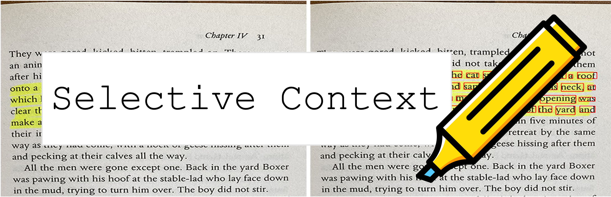

<p align="center">
    
</p>

# Selective Context for Large Language Models

Selective Context is a novel approach for optimizing the usage of context in Large Language Models (LLMs) by filtering out less informative content. This approach allows LLMs to process long documents and maintain extended conversations more efficiently without compromising their performance on various tasks. 

This repository contains the code and data for the paper: [Unlocking Context Constraints of LLMs: Enhancing Context Efficiency of LLMs with Self-Information-Based Content Filtering](https://arxiv.org/abs/2304.12102).

### Updates!!
Try our demo on [Huggingface Space](https://huggingface.co/spaces/liyucheng/selective_context).

## Key Features

- **Efficient Context Management**: Selective Context maximizes the utility of fixed context length in LLMs, allowing them to process long documents and extended conversations more efficiently.
- **Informativeness Evaluation**: Our method employs a base language model to compute self-information for lexical units (sentences, phrases, or tokens) in a context and use it to evaluate their informativeness.
- **Extensive Evaluation**: We provide extensive evaluations of Selective Context on three data sources (arxiv papers, BBC news articles, and conversation transcripts) and four different NLP tasks (summarization, question answering, original context reconstruction, and conversation).

## Getting Started

To get started, follow these steps:

1. Clone the repository:
   ```
   git clone https://github.com/liyucheng09/Selective_Context.git
   cd Selective_Context
   ```

2. Install the required packages:
   ```
   pip install -r requirements.txt
   ```

3. Run the Selective Context demo:
   ```
   python selective_context.py
   ```

4. If you prefer to try with web interface, try our streamlit app:
   ```
   streamlit run app/app.py
   ```

## Code Structure

- `selective_context.py`: A demo for performing context reduction using Selective Context.
- `context_manager.py`: The main module for managing context and implementing the Selective Context algorithm.
- `main.py`: The main script for running experiments and evaluating the effectiveness of Selective Context.
- `qa_manager.py`: A helper module for managing question answering tasks during the experiments.

## Experiments

To reproduce the experiments from the paper, run the following command:

```
python main.py
```

This will run the experiments on arxiv papers, BBC news articles, and conversation transcripts with four different NLP tasks: summarization, question answering, original context reconstruction, and conversation.

## Citation

If you find this repository helpful or use our method in your research, please consider citing our paper:

```
@misc{li2023unlocking,
      title={Unlocking Context Constraints of LLMs: Enhancing Context Efficiency of LLMs with Self-Information-Based Content Filtering}, 
      author={Yucheng Li},
      year={2023},
      eprint={2304.12102},
      archivePrefix={arXiv},
      primaryClass={cs.CL}
}
```

## License

This project is licensed under the [MIT License](LICENSE).